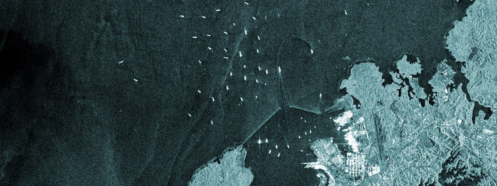

# SAR Vessel Detection — CA-CFAR Pipeline

A lightweight, single-file pipeline for detecting vessels in SAR (Synthetic Aperture Radar) imagery using the **Cell-Averaging CFAR** algorithm, with geofence filtering and GeoJSON export.



---

## Background

CFAR is a radar detection algorithm with roots going back to the 1960s. This was a personal exercise in rebuilding it from scratch with a modern Python geospatial stack, bridging the classical signal processing side with contemporary GIS tooling. Old algorithm, new plumbing.

---

## What It Does

1. Loads a single-band SAR GeoTIFF amplitude image
2. Applies a median speckle filter to reduce ocean noise
3. Runs CA-CFAR to adaptively threshold every pixel against its local background
4. Clusters bright-pixel hits into individual vessel detections
5. Filters out noise blobs below a minimum size
6. Reprojects all detections into geographic coordinates
7. Retains only vessels that fall within a user-supplied geofence polygon
8. Exports a WGS84 GeoJSON report ready for analyst tools (QGIS, ArcGIS, etc.)

---

## How CA-CFAR Works (Plain Language)

Think of the SAR image as a dark floor covered in LED lights. We want to find blindingly bright clusters (ships) against a flickering background (ocean).

For every pixel, a sliding window is placed over it:
- The **center** is the candidate target pixel
- The **guard ring** around it blocks the ship's own brightness from leaking into the measurement
- The **training ring** around that measures the average local ocean brightness

If the target pixel is significantly brighter than its local background, by a factor derived from your chosen false-alarm rate, it is flagged as a detection.

This adaptive threshold means the detector stays calibrated in both calm and rough sea states without manual tuning.

---

## Installation

```bash
git clone https://github.com/kluter/sar-cfar-vessel-detection.git
cd sar-cfar-vessel-detection
pip install -r requirements.txt
```

---

## Usage

```bash
python cfar_pipeline.py \
  --sar       path/to/image.tif \
  --geofence  path/to/geofence.geojson \
  --output    path/to/alerts.geojson \
  --pfa       1e-5 \
  --min-blob  3
```

---

## Known Limitations

- **No land mask.** Coastal clutter will generate false detections. In production, a vector land mask (e.g. [Natural Earth](https://www.naturalearthdata.com/) via geopandas) should zero out land pixels before the CFAR step.
- **Single polarization.** The pipeline expects a single-band amplitude image.
- **No radiometric calibration check.** Input is assumed to be a normalised GRD product.

---

## Data Sources for Testing

If you don't have access to commercial SAR data, these free sources work with this pipeline:
 
- [ASF DAAC](https://asf.alaska.edu/): Sentinel-1, ALOS PALSAR archive
- [ESA Copernicus Open Access Hub](https://scihub.copernicus.eu/): Sentinel-1 GRD products
- [ICEYE Sample Datasets](https://www.iceye.com/resources/datasets): Free SLC and GRD samples
- [TerraSAR-X Sample Data](https://earth.esa.int/eogateway/missions/terrasar-x-and-tandem-x/sample-data): Free sample products via ESA Earth Online

---

## License

MIT License — see [LICENSE](LICENSE) for details.